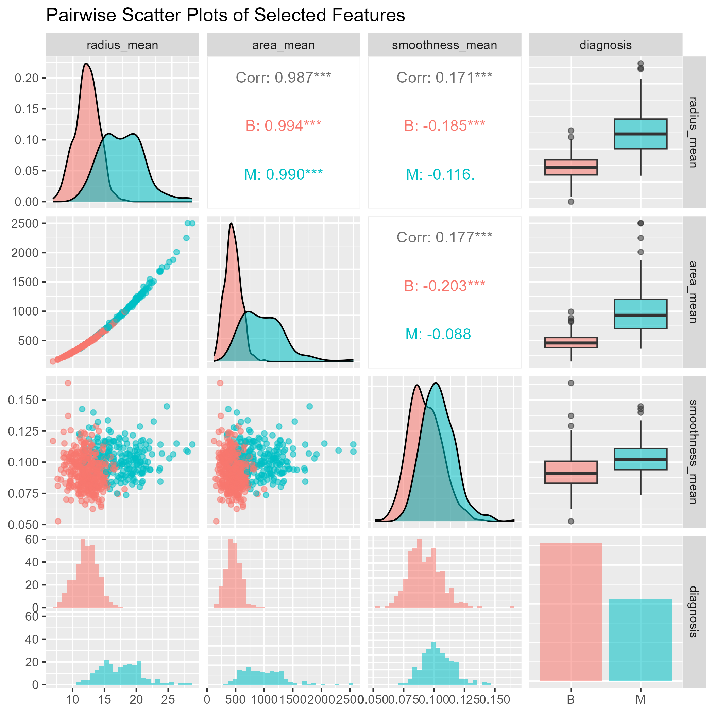
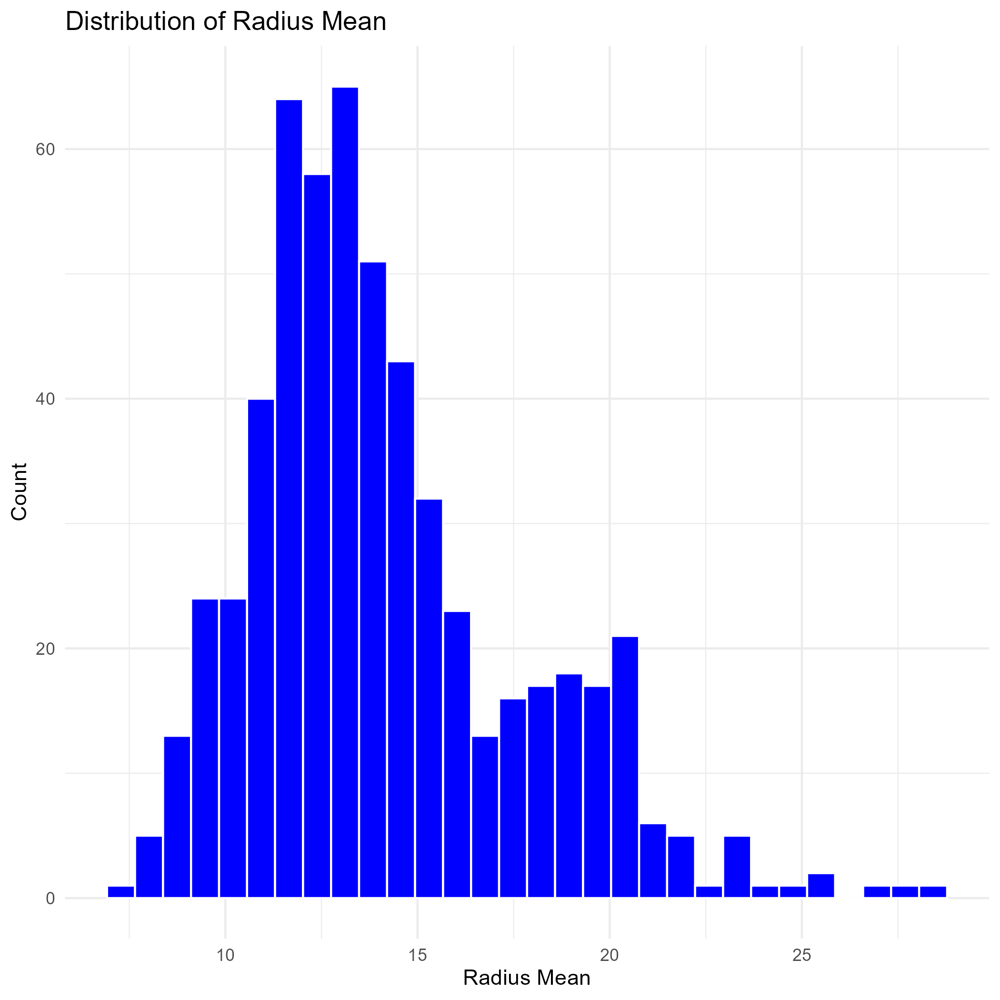
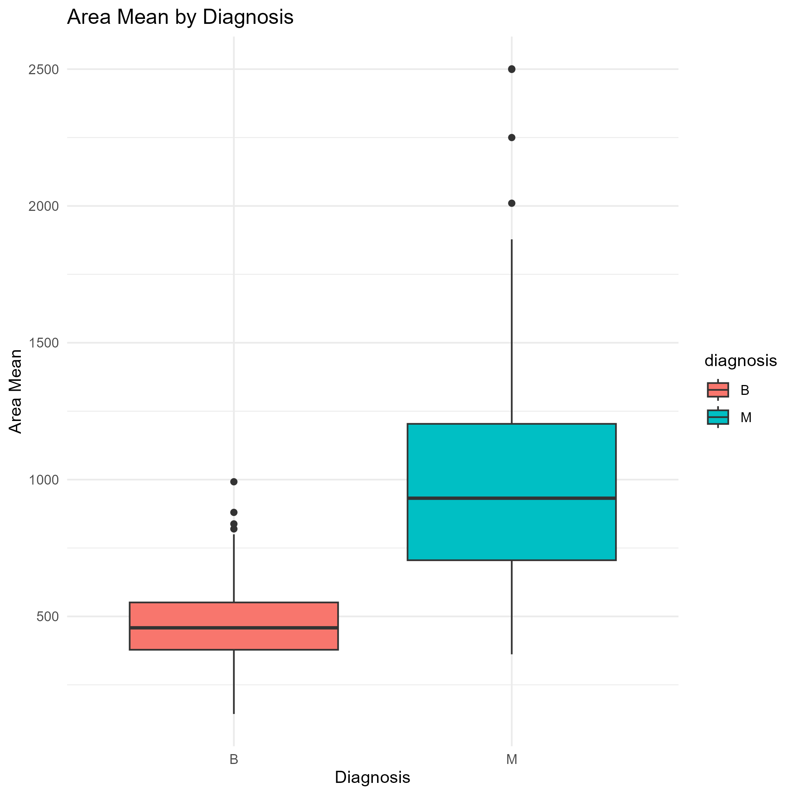
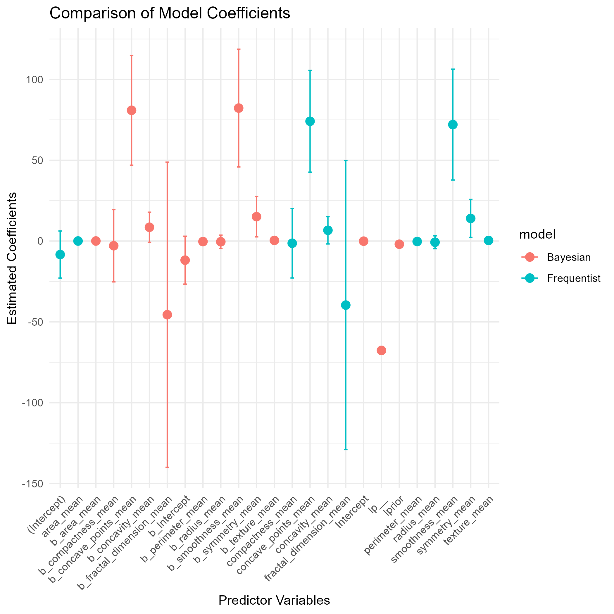
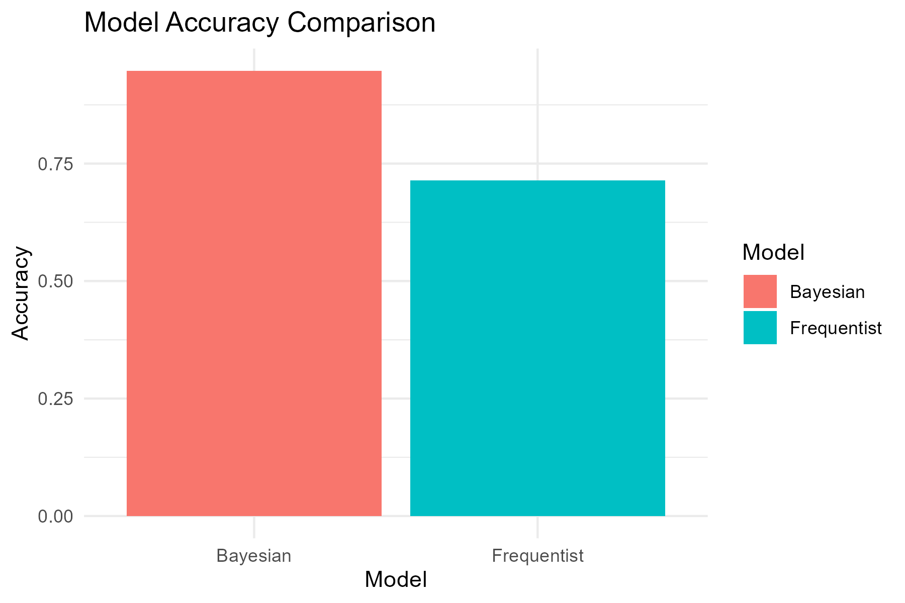

# 🧪 Bayesian Clinical Trial Analysis

This project implements a full clinical trial analysis pipeline using both **frequentist** and **Bayesian** statistical models. It includes data preprocessing, exploratory data analysis, model building, diagnostics, and FDA-style reporting. The goal is to simulate a real-world Bayesian clinical trial workflow using R and industry-aligned standards.

---

## 📄 Dataset Description

- **real_clinical_trial.csv** – Simulated real-world clinical trial data
- **train_data.csv / test_data.csv** – Preprocessed splits for model training/testing
- **data_dictionary.md** – Describes variables, formats, and units

---

## 🔄 Data Preprocessing

The 'real_clinical_trial.csv' dataset undergoes the following cleaning and preparation steps using 'tidyverse' and 'janitor':

- Clean column names
- Impute missing numeric values using mean
- Convert categorical columns to factors
- Split into training and test sets (80/20 split)
- Save cleaned datasets
---

## 🔍 Exploratory Data Analysis

---

## 📊 Modeling & Analysis
- frequentist_model.R: Logistic regression 
- bayesian_model.R: Bayesian hierarchical models using brms or rstanarm
- model_comparison.R: Compare models 
- adaptive_designs/: Implements Bayesian adaptive trials and stopping rules

---

## 🧪 Testing
The tests/ directory includes:
- Data quality checks
- Validation of models using test data

---

## 📊 Results & Visuals
### Model accuracy comparion

---

## 📑 Reporting

The project includes industry-style reporting:
- fda_style_report.Rmd: Full markdown-based clinical report
- clinical_summary.qmd: Lightweight summary using Quarto
- sap.md: Statistical Analysis Plan

---

## ⚡ Quick Start

Clone the repository:
- git clone (https://github.com/Nahian1504/bayesian_clinical_trial.git)
- cd bayesian_clinical_trial
- Restore R environment:
- Rscript -e 'install.packages("renv"); renv::restore()'
---

## 🐳 Reproducibility
- All packages and environments managed via renv.lock and requirements.txt
- Optional Dockerfile included for containerized runs
- GitHub Actions CI setup via .github/workflows/r-ci.yml

---

## 👤 Author

Nahian Tasnim
Data Science Portfolio Project — Bayesian Clinical Trial
GitHub: @Nahian1504

---

## 📄 License
MIT License © 2025

---

## 📞 Contact
Email: nahian.tasnim@slu.edu.

---
